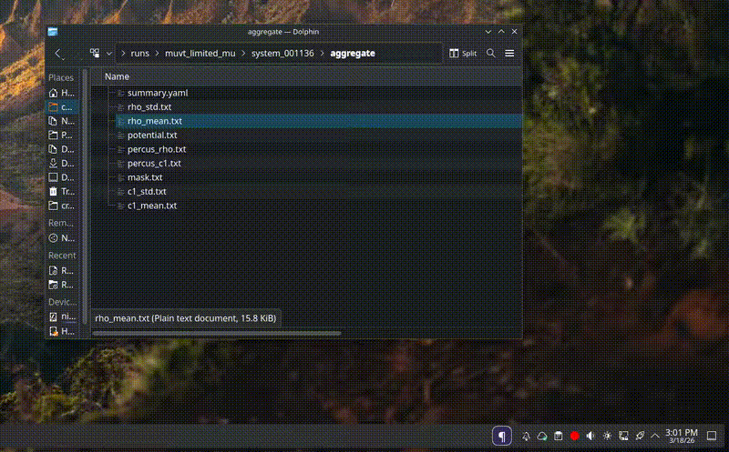

# Plot Drop

`Plot Drop` is a small Plasma 6 widget for plotting dropped text data files with `gnuplot`.

When you drop one file onto the widget, it opens a `gnuplot` window and plots that file as a line graph.
When you drop multiple files at once, it plots all of them together in the same `gnuplot` window.

## Demo

Add a GIF at `docs/plot-drop-demo.gif` and GitHub will render it inline here:



## Requirements

- Nix with flakes enabled
- A Plasma 6 desktop session

## Install

From the project directory:

```bash
nix develop
kpackagetool6 --type Plasma/Applet --install ./package
```

If the widget was already installed, upgrade it instead:

```bash
kpackagetool6 --type Plasma/Applet --upgrade ./package
```

After installation, add `Plot Drop` to your panel or desktop from the Plasma widget picker.

If Plasma does not pick up a widget change immediately, restart the shell:

```bash
systemctl --user restart plasma-plasmashell
```

## Usage

- Drop one text data file onto the widget to plot it.
- Drop multiple text data files onto the widget to plot them together.
- Each file is plotted as a line in `gnuplot`.

Example test data:

```bash
printf "0 0\n1 1\n2 4\n3 9\n" > sample-a.dat
printf "0 0\n1 2\n2 3\n3 5\n" > sample-b.dat
```

Then drag `sample-a.dat` or both files onto the widget.

## Remove

```bash
kpackagetool6 --type Plasma/Applet --remove com.example.plotdrop
```
